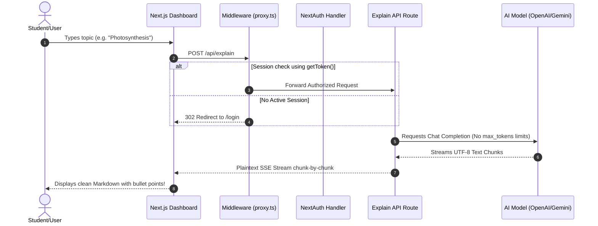

# ELI5 🧠✨

<div align="center">
  <p align="center">
    
  </p>
  <p>
    <strong>Turn any confusing, dry, or complex concept into a clear, engaging explanation that actually makes sense.</strong>
  </p>
  
  <p>
    <a href="http://localhost:3000"></a>
    <a href="https://github.com/meer-md-shoaib/eli5"></a>
    <a href="https://www.nextjs.org"></a>
    <a href="https://www.typescriptlang.org"></a>
  </p>

  <p>
    
    
    
  </p>
</div>

---

## 🎨 Premium Visual Architecture

ELI5 features a gorgeous, dark-themed glassmorphic design that shifts dynamically based on user topics:
- **Topic-Reactive Aurora**: Moving neon gradients breath life into the backgrounds.
- **Micro-Animations**: Hover-responsive buttons, custom sliders, and pulsing loading loops built using pure, accelerated CSS.
- **Credit Popup**: A beautiful, translucent glass badge anchored in the bottom-left corner crediting the creator:
  ```html
  Made by Meer Mohammed Shoaib
  ```
  It features an organic bounce-up transition (`@keyframes rise`) and can be dismissed instantly.

---

## 🛠️ System Architecture

The following diagram illustrates how your topic query travels from the frontend, passes through the Next.js 16 route middleware, and streams complete answers back:



---

## ⚡ Key Highlights

### 🎯 Tailored Voices
Swap between **10 unique learning personalities** including:
* **🧒 ELI5 Mode**: Simple analogies and child-friendly language.
* **🎓 High School Mode**: Academic concepts defined step-by-step.
* **👩‍💻 Programmer Mode**: Explanations via functions, objects, or syntax.
* **🧙 Wizard Mode**: Arcane, magical lore built around accurate science.
* **⚖️ Analogy Mode**: Strong, clear real-world metaphors.

### 📜 Slightly Shortened, Bullet-Pointed Responses
We redesigned the backend explanation system:
- **No Token Limits**: Explanations stream completely without being cut off by hard token limits.
- **Bullet-Point Structure**: The AI formats key answers directly into structured bullet points rather than dense, boring paragraphs.
- **Max Readability**: Every section includes explicit Markdown templates for summaries, takeaways, examples, and facts.

### 🔑 Flexible Authentication
- **Secure Email Login**: Credentials provider seeded locally.
- **Google & GitHub OAuth**: Easily toggle public login configurations. Setting `AUTH_ALLOW_ALL_OAUTH=true` allows developer credentials to sign in seamlessly.

---

## 📂 Tech Stack

| Component | Technology | Version | Purpose |
|---|---|---|---|
| **Framework** | Next.js (App Router) | `16.2.9` | Edge-optimized server rendering & API endpoints |
| **Language** | TypeScript | `5.9.3` | Total type safety and development autocomplete |
| **Styling** | Tailwind CSS & CSS Variables | `4.3.1` | Tailored neon variables and dark mode glassmorphism |
| **Icons** | Lucide React | `1.20.0` | Elegant, consistent vector icons |
| **Auth** | NextAuth | `4.24.14` | Local session and provider token validations |
| **AI Stream** | OpenAI SDK | `6.43.0` | Ultra-fast completion streaming |

---

## 🚀 Getting Started

### 1. Configure Environments

Create a `.env.local` file in your project root:

```env
# ── AI API Endpoint ────────────────────────────────────────────────────────
OPENAI_API_KEY=your_gemini_or_openai_api_key
OPENAI_BASE_URL=https://generativelanguage.googleapis.com/v1beta/openai
OPENAI_MODEL=gemini-2.5-flash

# ── Auth Configuration ──────────────────────────────────────────────────────
NEXTAUTH_URL=http://localhost:3000
NEXTAUTH_SECRET=generate_with_openssl_rand_hex_32

# Admin User credentials
AUTH_ADMIN_EMAIL=admin@eli5.dev
# Generated bcrypt hash for 'admin' (make sure $ symbols are escaped as \$)
AUTH_ADMIN_PASSWORD_HASH=\$2b\$12\$JuWTvMhCByhb4DEId99O/eq/rZfYhG/zeWSSehOPRaFd8ih8ERPBi

# OAuth Signin Settings
AUTH_ALLOW_ALL_OAUTH=true
GOOGLE_CLIENT_ID=your-google-client-id
GOOGLE_CLIENT_SECRET=your-google-client-secret
GITHUB_CLIENT_ID=your-github-client-id
GITHUB_GITHUB_SECRET=your-github-client-secret
```

### 2. Launch Local Environment

```bash
# Install dependencies
npm install

# Check types and compile
npm run typecheck

# Start the dev server
npm run dev
```

Visit [http://localhost:3000](http://localhost:3000) to login using `admin@eli5.dev` and the password `admin`.

---

<details>
<summary><strong>📜 Full License</strong></summary>

The above license applies to all source code. Special exceptions may apply to AI-generated content. See the full [LICENSE](LICENSE) file for complete details.

</details>

---

## 🙏 Acknowledgements

<p align="center">
  
</p>

ELI5 wouldn't exist without these amazing projects and people:

- **[OpenAI](https://openai.com)** — GPT-4 AI model
- **[Vercel](https://vercel.com)** — Next.js hosting
- **[Tailwind CSS](https://tailwindcss.com)** — Styling framework
- **[shadcn/ui](https://shadcn.ui.com)** — Component library
- **[Framer](https://framer.com)** — Motion library
- All our **contributors** and **users** 🌟

---

## 💬 Support

<p align="center">
  <a href="https://github.com/meer-md-shoaib/eli5/issues">
    
  </a>
</p>

### Get Help

- 📖 [Documentation](https://eli5.dev/docs)
- 🐛 [Report an Issue](https://github.com/meer-md-shoaib/eli5/issues)
- 📧 Email: shoaibmeermd@gmail.com

---

## ⭐ Star History

<p align="center">
  <a href="https://star-history.com/#meer-md-shoaib/eli5&Date">
    
  </a>
  <br>
  <em style="margin-top: 10px;">Join our growing community — <strong>2,500+ stars</strong> and <strong>500+ forks</strong></em>
</p>

---

## 🎉 Join the ELI5 Community

<p align="center">
  <table>
    <tr>
      <th>Platform</th>
      <th>Link</th>
    </tr>
    <tr>
      <td><strong>GitHub</strong></td>
      <td><a href="https://github.com/meer-md-shoaib/eli5">Follow</a></td>
    </tr>
    <tr>
      <td><strong>Discord</strong></td>
      <td><a href="https://discord.gg/eli5">Join</a></td>
    </tr>
  </table>
</p>

---

## 🏆 Creator & Credits

<p align="center">
  
</p>

<p align="center">
  <h3>✨ Created by <a href="https://github.com/meer-md-shoaib">Meer Mohammed Shoaib</a> ✨</h3>
  <p>
    <a href="https://github.com/meer-md-shoaib">
      
    </a>
    <a href="https://github.com/meer-md-shoaib">
      
    </a>
    <a href="mailto:shoaibmeermd@gmail.com">
      
    </a>
    <a href="https://www.linkedin.com/in/meermohammedshoaib/">
      
    </a>
    <a href="https://discord.com">
      
    </a>
  </p>
</p>

<div align="center">
  
### 🚀 About the Creator

> **Meer Mohammed Shoaib** is a passionate **Software Engineer** from **Bengaluru, Karnataka, India** who believes that *everyone deserves to understand the world around them*.
>
> ELI5 was born from a simple idea: **learning shouldn't be boring or inaccessible**. Whether you're a curious kid, a struggling student, or just someone who wants to understand quantum physics without a textbook, ELI5 adapts to *your* needs.
>
> With expertise in **modern web technologies** (Next.js, React, TypeScript) and a love for **creating beautiful user experiences**, Meer built ELI5 to make AI-powered learning accessible to everyone — not just the tech-savvy.
>
> 💡 *"If I can explain quantum entanglement to a 5-year-old, I can explain anything to anyone."*
>
> ---
>
> 🌟 **Fun fact**: Meer spent months designing ELI5's 10 unique explanation modes (from Pirate to Grandma) because he believed *personality matters in learning*.
>
> 🎯 **Current mission**: Making ELI5 the most beautiful, fastest, and most helpful learning platform on GitHub.
>
> 👨💻 **When not coding**: Exploring new AI models, testing explanations on friends, or dreaming up even more creative learning modes.

</div>

---

<p align="center">

# 🚀 Ready to Transform Learning?

<a href="https://eli5.demo.com"></a>
<a href="https://github.com/meer-md-shoaib/eli5"></a>
<a href="https://github.com/meer-md-shoaib/eli5"></a>
<a href="https://github.com/meer-md-shoaib"></a>

<br><br>
<strong>Made with ❤️ by <a href="https://github.com/meer-md-shoaib">Meer Mohammed Shoaib</a> — The ELI5 Team</strong>
<br>
<em>Explain Like I'm 5 — Making learning accessible to everyone</em>
<br>
<em style="margin-top: 10px; font-size: 14px;">📍 Bengaluru, Karnataka, India | 🚀 Built with Next.js 16, React 19, TypeScript 5, Tailwind CSS 4</em>

</p>

---

<p align="center">
  
  
  
  
  
</p>
